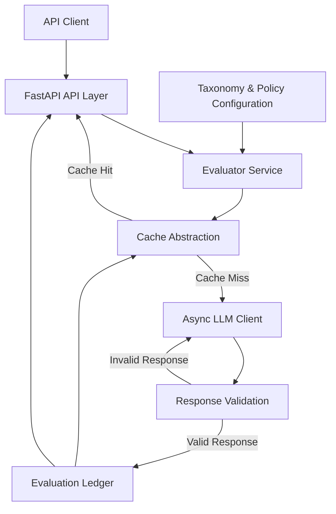
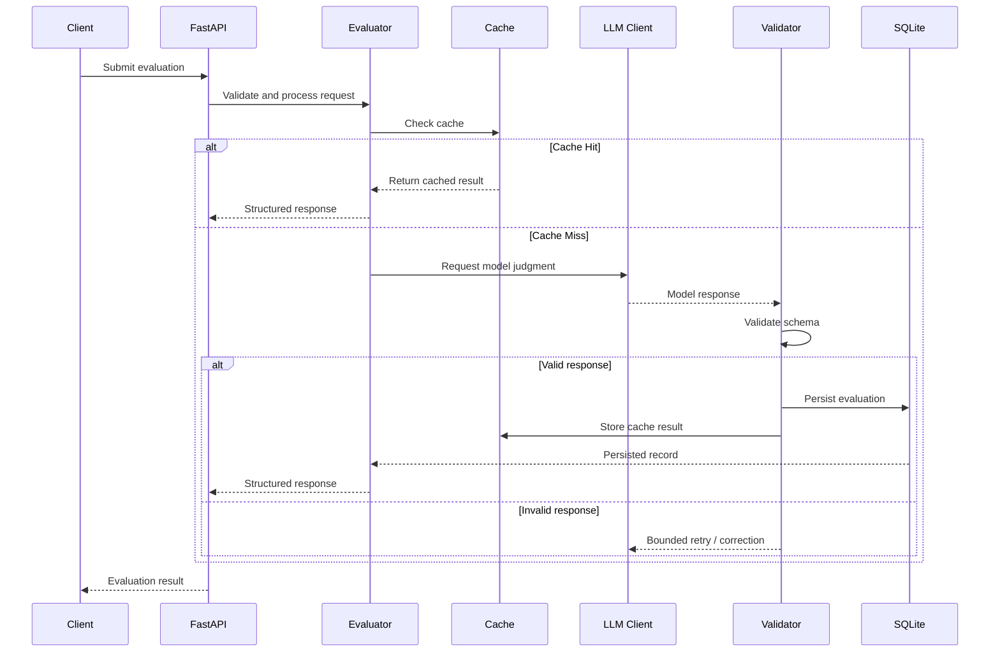

# ICP Taxonomy Policy Evaluation Framework

**LLM-as-a-Judge | Async FastAPI | Structured Output Validation | Auditability**

A backend service for evaluating product and merchant listings against locale-specific Ideal Customer Profile (ICP) taxonomy policies using a Large Language Model (LLM).

The project explores how AI-powered classification can be integrated into a reliable backend pipeline through structured output validation, bounded asynchronous processing, caching, and persistent evaluation records.

> **Project Status:** 🚧 Under active development

---

## Table of Contents

- [Overview](#overview)
- [Problem Statement](#problem-statement)
- [Engineering Objectives](#engineering-objectives)
- [Core Features](#core-features)
- [Architecture](#architecture)
- [Request Lifecycle](#request-lifecycle)
- [Technology Stack](#technology-stack)
- [Project Structure](#project-structure)
- [Getting Started](#getting-started)
- [API Usage](#api-usage)
- [Evaluation Strategy](#evaluation-strategy)
- [Reliability and Failure Handling](#reliability-and-failure-handling)
- [Project Status](#project-status)
- [Roadmap](#roadmap)
- [Engineering Decisions](#engineering-decisions)
- [Author](#author)

---

## Overview

FinTech platforms, marketplaces, and growth-operations teams may need to evaluate large numbers of products or merchants against region-specific classification policies.

Traditional manual review is difficult to scale, while unconstrained LLM-based classification can produce inconsistent formatting, uncertain decisions, and outputs that downstream services cannot safely consume.

This project implements an LLM-based policy evaluation framework that separates:

1. Policy and taxonomy configuration.
2. Evaluation orchestration.
3. Model interaction.
4. Response validation.
5. Caching.
6. Persistent evaluation records.

The objective is to demonstrate how an LLM can be integrated into a backend service with explicit data contracts, traceable decisions, and controlled request processing.

**This is an engineering demonstration and is not a certified regulatory compliance system.**

---

## Problem Statement

Given a product or merchant description and a target locale, the service evaluates the input against the corresponding ICP taxonomy policy.

A typical evaluation involves:

- Identifying the applicable locale-specific policy.
- Constructing a structured evaluation prompt.
- Requesting a classification from an LLM.
- Validating the model response.
- Recording the evaluation result.
- Returning a structured response to the API consumer.

### Example Use Case

A marketplace receives a product listing:

```json
{
  "product_name": "Example Financial Product",
  "description": "A financial service offering ...",
  "locale": "DE"
}
```

The evaluator uses the relevant policy configuration to produce a structured judgment.

The output should be treated as a model-generated assessment that requires appropriate validation and, where necessary, human review.

---

## Engineering Objectives

This project focuses on the following backend and AI engineering challenges:

| Challenge | Engineering Approach |
|---|---|
| Unstructured model output | Pydantic-based schema validation |
| High-volume evaluation | Bounded asynchronous request processing |
| Repeated evaluations | Content-based cache key design |
| Traceability | Persistent evaluation ledger |
| Model/API failures | Explicit error handling and bounded retries |
| Policy changes | Policy-version-aware evaluation records |
| Classification uncertainty | Separate structural validity from business-level confidence |

The implementation should distinguish between a response that is **structurally valid** and a classification that is **actually correct**.

Schema validation alone does not establish the correctness of an LLM's judgment.

---

## Core Features

### 1. Locale-Aware Taxonomy Evaluation

- Evaluate product or merchant descriptions against configured policies.
- Support locale-specific policy selection.
- Keep taxonomy definitions separate from evaluation orchestration.

### 2. Structured LLM Output

- Define an explicit response schema.
- Parse and validate model output using Pydantic.
- Handle invalid responses through typed failures.
- Avoid allowing malformed model output to propagate silently.

### 3. Asynchronous Evaluation

- Use asynchronous model requests where supported.
- Process batch inputs concurrently.
- Apply bounded concurrency to control request volume.
- Handle individual request failures without assuming that every item succeeds.

### 4. Content-Based Caching

Design cache keys using relevant evaluation inputs, such as:

```text
hash(input + locale + policy_version)
```

This helps identify repeated evaluations while allowing policy changes to invalidate previous results.

The cache abstraction is intended to separate caching behavior from the underlying storage implementation.

### 5. Evaluation Ledger

Store relevant evaluation metadata, subject to the actual implementation:

- Evaluation timestamp.
- Input hash.
- Locale.
- Policy version.
- Raw or normalized model output.
- Parsed evaluation result.
- Evaluation status.

The ledger is designed to support traceability and later analysis.

---

## Architecture



### Architectural Responsibilities

| Component | Responsibility |
|---|---|
| FastAPI | HTTP routing, request handling, and API documentation |
| Evaluator Service | Orchestrates policy selection, cache lookup, and model evaluation |
| Taxonomy Configuration | Stores policy definitions and locale mappings |
| LLM Client | Handles model requests and response retrieval |
| Validation Layer | Enforces the expected response contract |
| Cache Layer | Avoids unnecessary repeated evaluations |
| SQLite Ledger | Persists evaluation records |

> The architecture diagram represents the intended service design. Keep it synchronized with the actual codebase as the implementation evolves.

---

## Request Lifecycle

### Single Evaluation



### Batch Evaluation

The batch endpoint is intended to reuse the single-evaluation pipeline across multiple inputs.

The implementation should:

1. Validate the incoming batch.
2. Apply bounded concurrency.
3. Process individual evaluations.
4. Track successes and failures.
5. Return a predictable batch response.

Concurrency limits should be configurable rather than relying on unlimited task creation.

---

## Technology Stack

| Technology | Purpose |
|---|---|
| **Python** | Core application development |
| **FastAPI** | Async API framework and HTTP endpoints |
| **Pydantic** | Request and response validation |
| **OpenAI SDK** | LLM integration |
| **asyncio** | Concurrent I/O-bound processing |
| **SQLite** | Local persistent evaluation ledger |
| **Cache Abstraction** | Decouples cache operations from storage |
| **Pytest** *(if configured)* | Automated testing |

### Why These Technologies?

**FastAPI**

Provides an API framework with asynchronous endpoint support and automatically generated OpenAPI documentation.

**Pydantic**

Defines the contract between model-generated output and the rest of the application. It validates data structure and types but does not guarantee semantic classification accuracy.

**asyncio**

Supports concurrent I/O-bound work, which is relevant when a batch requires multiple external model requests.

**SQLite**

Provides local persistence without requiring a separate database server. It is suitable for development and small-scale demonstrations, subject to the application's concurrency and deployment requirements.

**Caching**

A dedicated cache abstraction can allow the evaluation service to remain independent of the underlying cache implementation. A production Redis integration would still require validation of expiration, failure behavior, concurrency, and serialization semantics.

---

## Project Structure

The following structure is illustrative. Keep it synchronized with the repository's actual files.

```text
icp-policy-evaluator/
│
├── src/
│   ├── main.py
│   │
│   ├── api/
│   │   └── ...
│   │
│   ├── core/
│   │   └── ...
│   │
│   ├── models/
│   │   └── taxonomy.py
│   │
│   ├── services/
│   │   └── ...
│   │
│   └── ...
│
├── tests/
│   └── ...
│
├── .env.example
├── requirements.txt
├── Dockerfile
├── .gitignore
└── README.md
```

As modules are added, update this section with the actual structure and a short description of each important module.

---

## Getting Started

### Prerequisites

- Python 3.10+
- An LLM API key for the configured provider.
- Git.

### 1. Clone the Repository

```bash
git clone https://github.com/rishabhbhawsar/icp-policy-evaluator.git
cd icp-policy-evaluator
```

### 2. Create a Virtual Environment

#### Windows

```powershell
python -m venv .venv
.venv\Scripts\Activate.ps1
```

#### Linux / macOS

```bash
python3 -m venv .venv
source .venv/bin/activate
```

### 3. Install Dependencies

If `requirements.txt` is available:

```bash
pip install -r requirements.txt
```

Otherwise, install dependencies according to the project's package configuration.

### 4. Configure Environment Variables

Create a local `.env` file using the project's environment configuration.

Example:

```env
OPENAI_API_KEY=your_api_key_here
```

**Never commit API keys or secrets to Git.**

### 5. Start the API

If the application entry point is `src.main:app`:

```bash
uvicorn src.main:app --reload
```

Open the API documentation:

```text
http://127.0.0.1:8000/docs
```

> Verify the actual entry point, environment variable names, and dependency installation instructions against the current source code.

---

## API Usage

The following examples are illustrative. Update the request and response bodies to match the actual Pydantic models and routes implemented in the repository.

### Single Evaluation

```http
POST /evaluate
Content-Type: application/json
```

Example request:

```json
{
  "product_name": "Example Product",
  "description": "Example product description",
  "locale": "DE"
}
```

Example response structure:

```json
{
  "status": "success",
  "classification": "example_category",
  "confidence": 0.91,
  "policy_version": "v1"
}
```

The response example is a placeholder. Do not present it as an actual API response until it has been tested against the running application.

### Batch Evaluation

```http
POST /batch
Content-Type: application/json
```

Example request:

```json
{
  "items": [
    {
      "product_name": "Product A",
      "description": "Description A",
      "locale": "DE"
    },
    {
      "product_name": "Product B",
      "description": "Description B",
      "locale": "BR"
    }
  ]
}
```

The batch response contract should document how successful evaluations, validation failures, and request-level errors are represented.

### Additional Endpoints

| Endpoint | Purpose |
|---|---|
| `GET /health` | Service health check |
| `GET /taxonomy` | Taxonomy access, if implemented |
| `POST /evaluate` | Single evaluation, if implemented |
| `POST /batch` | Batch evaluation, if implemented |

---

## Evaluation Strategy

An LLM-based evaluation system should be assessed using measurable criteria rather than model output alone.

### Planned Evaluation Metrics

| Metric | Description |
|---|---|
| Schema Adherence Rate | Percentage of model responses passing schema validation |
| Validation Failure Rate | Percentage of responses rejected by validation |
| Cache Hit Rate | Percentage of eligible requests served from cache |
| Latency | Time taken to complete an evaluation |
| Concurrent vs. Sequential Latency | Comparison under a defined workload |
| Precision | Fraction of predicted positive classifications that are correct |
| Recall | Fraction of relevant positive classifications that are identified |
| False-Positive Rate | Frequency of incorrect positive classifications |

### Benchmark Requirements

For reproducible results, document:

- Model and configuration.
- Dataset size.
- Labeling methodology.
- Policy and taxonomy version.
- Concurrency limit.
- Number of trials.
- Hardware and deployment environment.
- Failure and retry handling.

**Benchmark results should be added only after they have been measured using the evaluation harness.**

---

## Reliability and Failure Handling

The system distinguishes between multiple types of failure.

### Structural Failure

The model returns output that does not conform to the expected schema.

Possible handling:

- Parse the response.
- Validate using Pydantic.
- Retry within a bounded limit where appropriate.
- Return a typed error if validation continues to fail.

### Model or Network Failure

The external model service may experience transient failures or timeouts.

The client should define appropriate error handling and retry behavior without creating uncontrolled request loops.

### Business-Level Uncertainty

A structurally valid response may still contain an incorrect classification or unreliable confidence value.

Schema validation cannot establish the correctness of a business decision.

For compliance-sensitive applications, model judgments should be evaluated against labeled data and supported by suitable review and governance processes.

---

## Project Status

### Implementation Checklist

Update the following checklist as the corresponding functionality is actually implemented and tested.

- [ ] Taxonomy and policy configuration
- [ ] Locale-aware evaluation
- [ ] Pydantic request and response schemas
- [ ] LLM client integration
- [ ] Structured response validation
- [ ] Bounded asynchronous evaluation
- [ ] Single evaluation endpoint
- [ ] Batch evaluation endpoint
- [ ] Cache abstraction
- [ ] SQLite evaluation ledger
- [ ] Retry and failure handling
- [ ] Automated tests
- [ ] Benchmark / evaluation harness
- [ ] Docker configuration
- [ ] Deployment

### Development Approach

The project is being developed incrementally, with functionality added and validated in stages.

The commit history documents the progression of the implementation.

Each commit should ideally represent a coherent engineering change that can be understood and tested independently.

---

## Roadmap

### Phase 1 — Core Foundations

- Define application configuration.
- Establish taxonomy and policy schemas.
- Implement request and response models.
- Configure application entry points.

### Phase 2 — Model Integration

- Implement the asynchronous LLM client.
- Add structured output handling.
- Define error and retry behavior.
- Validate model responses.

### Phase 3 — Evaluation Service

- Implement locale-aware policy evaluation.
- Add cache lookup and storage.
- Persist evaluation records.
- Expose the single-evaluation endpoint.

### Phase 4 — Batch Processing

- Implement bounded concurrent evaluation.
- Add batch request validation.
- Define per-item failure handling.
- Measure sequential and concurrent execution.

### Phase 5 — Testing and Evaluation

- Add unit and integration tests.
- Build a labeled validation dataset.
- Measure schema adherence and classification performance.
- Document benchmark methodology.

### Phase 6 — Deployment

- Add container configuration.
- Validate environment-based configuration.
- Evaluate persistent storage requirements.
- Document deployment limitations and operational considerations.

---

## Engineering Decisions

### Why Async Processing?

Model API calls are I/O-bound. Asynchronous execution can allow multiple requests to make progress without requiring a separate thread for each request.

The performance benefit depends on the workload, concurrency limits, API latency, rate limits, and implementation details.

### Why Schema Validation?

LLMs generate probabilistic output. Explicit schemas provide a boundary for validating the data consumed by downstream application logic.

Validation should be treated as one layer of reliability, not a guarantee of classification correctness.

### Why Policy-Versioned Cache Keys?

A classification may depend on the policy version used during evaluation.

Including the policy version in the cache key helps prevent results from an older policy configuration from being reused unintentionally after policy changes.

### Why SQLite?

SQLite provides a low-infrastructure persistence option for local development and small-scale deployments.

A production system with higher write concurrency, multiple instances, or stronger operational requirements may need a different persistence architecture.

---

## Author

**Rishabh Bhawsar**

- LinkedIn: [Rishabh Bhawsar](https://www.linkedin.com/in/rishabh-bhawsar-409098262/)
- GitHub: [rishabhbhawsar](https://github.com/rishabhbhawsar)

---

## Disclaimer

This project is an engineering demonstration of LLM-based taxonomy evaluation.

It is not a substitute for legal advice, regulatory certification, or production compliance controls. Any real-world deployment would require domain-specific policy validation, testing, security review, and appropriate human oversight.